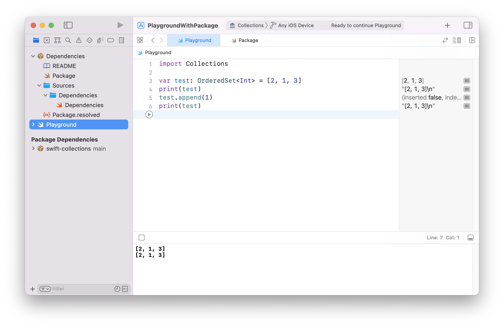

# Xcode Playground with Swift Package

XcodeのPlaygroundでSwift Packageを使うことができるWorkspaceのサンプル

このサンプルではSwift Collectionsが使えるようになっています。

参考: [How to Import a Swift Package Into a Playground | by Sagun Raj Lage | Better Programming](https://betterprogramming.pub/import-a-swift-package-into-a-playground-1bb650e196b0)

## 作り方

1. 適当にフォルダを作る(PlaygroundWithPackage)
2. 1.のディレクトリ内に適当にXcodeからWorkspaceを作る(PlaygroundWithPackage.xcworkspace)
3. 1.のディレクトリ内にlaygroundを作る(Playground.playground。このとき `Add to:` と `Group:` で先程作成したWorkspaceを指定する)
4. 1.のディレクトリ内にSwift Packageの依存記述用のSwift Packageを作る( `mkdir Dependencies & cd Dependencies && swift package init --name Dependencies` )
5. 生成された[Package.swift](Dependencies/Package.swift)を編集して使いたいパッケージを追加する
6. [Dependencies.swift](Dependencies/Sources/Dependencies/Dependencies.swift)に使いたいパッケージを `@_exported` をつけてimportする
7. Workspaceを開き直してXcodeにパッケージをフェッチさせる
8. Playgroundでパッケージをimportする
